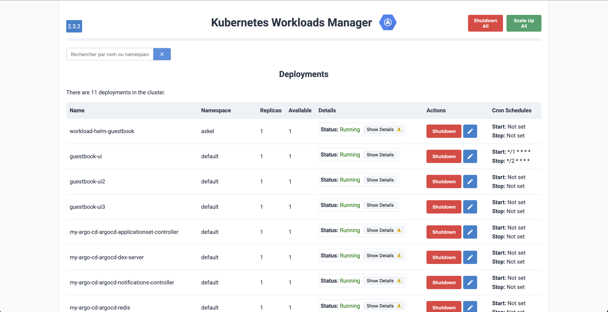
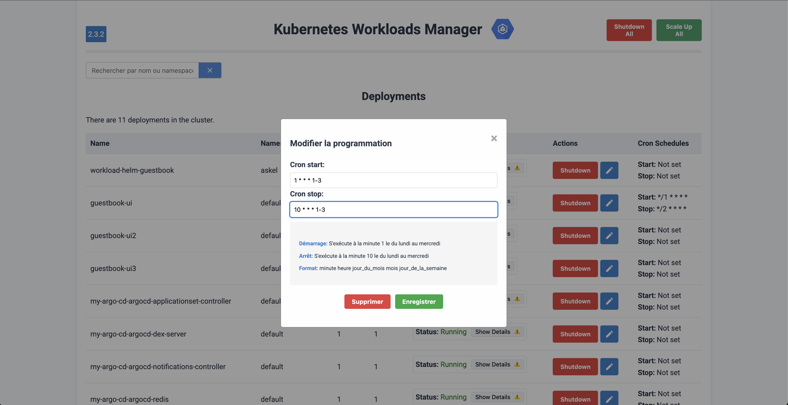

# Workload Scheduler

## Description du projet
 

Workload Scheduler est une application FastAPI qui permet de gérer et planifier les charges de travail Kubernetes (deployments, statefulsets, daemonsets) selon des expressions cron. Cet outil offre la possibilité de démarrer et arrêter automatiquement des workloads Kubernetes, optimisant ainsi les ressources du cluster en fonction de plannings prédéfinis.

## Fonctionnalités

### Principales fonctionnalités

- **Gestion des workloads Kubernetes**: Visualisation et gestion des Deployments, StatefulSets et DaemonSets
- **Planification par cron**: Configuration d'expressions cron pour le démarrage et l'arrêt automatique des workloads
- **Interface web**: Interface utilisateur pour visualiser et gérer facilement les planifications
- **API REST**: Points d'accès RESTful pour intégrer le scheduler avec d'autres outils
- **Intégration avec ArgoCD**: Gestion de la synchronisation automatique des applications ArgoCD
- **Stockage persistant**: Base de données SQLite pour stocker les configurations et l'état des planifications

### Détails des fonctionnalités

#### 1. Gestion des workloads Kubernetes

- Listage de tous les Deployments, StatefulSets et DaemonSets dans le cluster
- Filtrage des ressources par namespace
- Exclusion des namespaces protégés (configurable)
- Détails des pods associés à chaque workload

#### 2. Planification par cron

- Définition d'expressions cron pour le démarrage automatique des workloads
- Définition d'expressions cron pour l'arrêt automatique des workloads
- Validation et nettoyage des expressions cron
- Surveillance continue des planifications pour démarrer/arrêter les workloads au moment défini

#### 3. Interface web

- Vue d'ensemble de tous les workloads et leur état de planification
- Interface de configuration des planifications
- Visualisation en temps réel de l'état des workloads

#### 4. API REST

- Points d'accès pour récupérer, créer, mettre à jour et supprimer des planifications
- Documentation API via Swagger UI (accessible à `/docs`)

#### 5. Intégration avec ArgoCD

- Gestion automatique des jetons d'authentification ArgoCD
- Activation/désactivation de la synchronisation automatique pour les applications ArgoCD

## Getting Started

### Prérequis

- Python 3.8+
- Kubernetes cluster avec accès API
- Autorisations nécessaires pour gérer les Deployments, StatefulSets et DaemonSets

### Installation

#### Option 1: Utilisation de Docker

```bash
# Cloner le dépôt
git clone https://github.com/your-org/workload-scheduler.git
cd workload-scheduler

# Construire l'image Docker
task build

# Exécuter le conteneur
task run
```

#### Option 2: Installation locale

```bash
# Cloner le dépôt
git clone https://github.com/your-org/workload-scheduler.git
cd workload-scheduler

# Créer un environnement virtuel
python -m venv venv
source venv/bin/activate  # Sur Windows: venv\Scripts\activate

# Installer les dépendances
task install-dep

# Configurer l'environnement pour le développement local
export KUBE_ENV=development
export APP_ENV=development
export API_URL=http://localhost:8000
export ARGOCD_API_URL=http://localhost:8080/api/v1
export ARGOCD_USERNAME=username
export ARGOCD_PASSWORD=password
export TEST_WRIGHT=true
export JWT_SECRET_KEY=""

# Exécuter l'application
task run-dev

# Exécuter le scheduler externe
task run-scheduler
```

### Configuration

Les variables d'environnement suivantes sont disponibles pour configurer l'application:

| Variable | Description | Valeur par défaut |
|----------|-------------|------------------|
| `LOG_LEVEL` | Niveau de journalisation (TRACE, DEBUG, INFO, SUCCESS, WARNING, ERROR, CRITICAL) | INFO |
| `KUBE_ENV` | Environnement Kubernetes (development, production) | production |
| `APP_ENV` | Environnement d'application (development, production) | development |
| `ARGOCD_API_URL` | URL de l'API ArgoCD | - |
| `ARGOCD_USERNAME` | Nom d'utilisateur ArgoCD | username |
| `ARGOCD_PASSWORD` | Mot de passe ArgoCD | password |
| `JWT_SECRET_KEY` | Clé secrète pour la validation des jetons JWT | - |
| `UNLEASH_API_URL` | URL de l'API Unleash pour la gestion des fonctionnalités | - |
| `UNLEASH_API_TOKEN` | Jeton d'API Unleash | - |

### Accès à l'application

Une fois l'application démarrée, vous pouvez y accéder via:

- Interface web: <http://localhost:8000>
- Documentation API: <http://localhost:8000/docs>

## Guide d'utilisation

### Captures d'écran de l'interface

#### Vue d'ensemble des workloads

L'interface principale affiche tous les Deployments disponibles dans le cluster avec leur statut, leurs répliques et leurs planifications configurées :



#### Configuration des planifications cron

Pour configurer les expressions cron de démarrage et d'arrêt d'un workload, cliquez sur l'icône de modification à côté du workload souhaité :



Cette interface permet de :
- Définir l'expression cron de démarrage (Cron start)
- Définir l'expression cron d'arrêt (Cron stop)
- Voir des exemples d'expressions cron courantes
- Valider et enregistrer les modifications

### Vidéo de démonstration

Pour une compréhension rapide des fonctionnalités et de l'utilisation du Workload Scheduler, consultez notre vidéo de démonstration :

<video src="documentation/how_use_workload_scheduler.mp4" width="320" height="240" controls></video>

### Interface Web

1. **Page d'accueil**: Affiche tous les Deployments, StatefulSets et DaemonSets disponibles
2. **Configuration des planifications**:
   - Cliquez sur un workload pour afficher ses détails
   - Configurez les expressions cron pour le démarrage et l'arrêt
   - Sauvegardez la configuration

### API REST

#### Gestion des planifications

```bash
# Récupérer toutes les planifications
curl -X GET http://localhost:8000/schedules

# Récupérer une planification spécifique par UID
curl -X GET http://localhost:8000/schedule/{uid}

# Créer une nouvelle planification
curl -X POST http://localhost:8000/schedule \
  -H "Content-Type: application/json" \
  -d '{"name": "mon-service", "uid": "1234-5678", "cron_start": "0 8 * * 1-5", "cron_stop": "0 18 * * 1-5"}'

# Mettre à jour une planification existante
curl -X PUT http://localhost:8000/schedules/{schedule_id} \
  -H "Content-Type: application/json" \
  -d '{"name": "mon-service", "uid": "1234-5678", "cron_start": "0 9 * * 1-5", "cron_stop": "0 17 * * 1-5"}'

# Supprimer une planification
curl -X DELETE http://localhost:8000/schedules/{schedule_id}

# Supprimer les expressions cron d'une planification sans la supprimer
curl -X PUT http://localhost:8000/schedule/{uid}/remove-crons
```

### Expressions cron

Les expressions cron suivent le format standard (minute heure jour_du_mois mois jour_de_la_semaine):

- `0 8 * * 1-5`: Tous les jours de la semaine (lundi à vendredi) à 8h00
- `0 18 * * 1-5`: Tous les jours de la semaine (lundi à vendredi) à 18h00
- `0 0 * * 0`: Tous les dimanches à minuit

## Guide du développeur

### Structure du projet

```
workload-scheduler/
├── src/
│   ├── api/
│   │   ├── scheduler.py      # Routes API pour la gestion des planifications
│   │   ├── workload.py       # Routes API pour la gestion des workloads
│   ├── core/
│   │   ├── dbManager.py      # Gestion de la base de données
│   │   ├── kub_list.py       # Fonctions pour lister les ressources Kubernetes
│   │   ├── models.py         # Modèles de données
│   ├── scheduler_engine.py   # Moteur de planification
│   ├── static/               # Fichiers statiques pour l'interface web
│   ├── templates/            # Templates
│   ├── tests/                # Tous les tests
│   ├── utils/
│   │   ├── argocd.py         # Gestion de l'intégration ArgoCD
│   │   ├── clean_cron.py     # Validation et nettoyage des expressions cron
│   │   ├── config.py         # Configuration globale
│   │   ├── helpers.py        # Fonctions utilitaires
│   ├── main.py               # Point d'entrée de l'application
├── data/                     # Répertoire pour la base de données SQLite
├── requirements.txt          # Dépendances
├── Dockerfile                # Configuration Docker
```

### Flux d'exécution principal

1. L'application démarre dans `main.py`
2. Initialisation de la base de données via `DatabaseManager`
3. Initialisation du token ArgoCD si configuré
4. Récupération des workloads Kubernetes (Deployments, StatefulSets, DaemonSets)
5. Stockage des UIDs des workloads dans la base de données
6. Démarrage du serveur FastAPI
7. Le moteur de planification (`SchedulerEngine`) vérifie périodiquement les planifications

### Modèle de données

Le modèle principal `WorkloadSchedule` (défini dans `core/models.py`) comprend:

- `id`: Identifiant unique de la planification
- `name`: Nom du workload
- `uid`: Identifiant unique du workload dans Kubernetes
- `last_update`: Date et heure de la dernière mise à jour
- `status`: Statut actuel de la planification (NOT_SCHEDULED, SCHEDULED)
- `active`: Indique si la planification est active
- `cron_start`: Expression cron pour le démarrage
- `cron_stop`: Expression cron pour l'arrêt

### Extension et personnalisation

#### Ajout de nouveaux types de ressources Kubernetes

Pour ajouter la prise en charge d'autres types de ressources Kubernetes:

1. Ajoutez une nouvelle fonction dans `kub_list.py` pour lister le type de ressource
2. Mettez à jour la logique dans `main.py` pour récupérer et stocker les UIDs
3. Adaptez les templates et l'interface utilisateur si nécessaire

#### Personnalisation de l'interface utilisateur

L'interface utilisateur est construite avec Jinja2 et des templates HTML/CSS:

1. Modifiez les fichiers dans le répertoire `templates/`
2. Mettez à jour les styles dans le répertoire `static/`

#### Ajout de fonctionnalités API

Pour ajouter de nouveaux points d'accès API:

1. Créez une nouvelle fonction de route dans `api/scheduler.py` ou `api/workload.py`
2. Définissez le chemin, la méthode HTTP et les paramètres requis
3. Implémentez la logique métier

### Débogage

#### Journalisation

L'application utilise `loguru` pour la journalisation. Définissez le niveau de journalisation avec la variable d'environnement `LOG_LEVEL`:

```bash
export LOG_LEVEL=DEBUG
```

Les niveaux disponibles sont: TRACE, DEBUG, INFO, SUCCESS, WARNING, ERROR, CRITICAL

#### Activation du mode de développement

Pour activer le rechargement automatique et d'autres fonctionnalités de développement:

```bash
export APP_ENV=development
```

#### Utilisation de icecream pour le débogage

Le projet utilise `icecream` pour faciliter le débogage:

```python
from icecream import ic
ic(variable)  # Affiche le nom et la valeur de la variable
```

### Tests

Pour exécuter les tests:

```bash
# Exécuter tous les tests
pytest

# Exécuter les tests avec une couverture de code
pytest --cov=src
```

## Contribution

### Workflow de développement

1. Créez une branche à partir de `main` pour votre fonctionnalité ou correction
2. Développez et testez vos modifications
3. Soumettez une pull request vers `main`
4. Assurez-vous que les tests CI passent

### Conventions de code

- Suivez PEP 8 pour le style de code Python
- Utilisez des docstrings pour documenter les fonctions et classes
- Commentez le code complexe
- Utilisez des noms de variables et de fonctions descriptifs

## Licence 